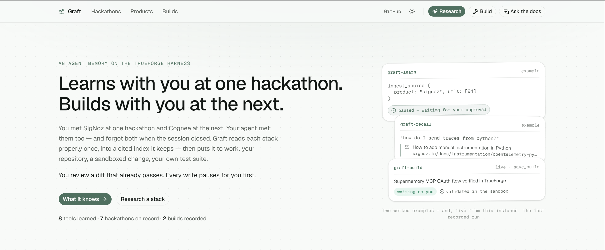

# Graft

**Learns with you at one hackathon. Builds with you at the next.**



Built for [The Agent Harness Hackathon](https://www.wemakedevs.org/hackathons/trueforge)
(WeMakeDevs × TrueFoundry × Qodo) on [TrueForge](https://trueforge.dev).

---

## The problem

WeMakeDevs runs a hackathon every few weeks, each built on a different stack. SigNoz for
observability. Cognee for agent memory. Zerops for infrastructure. TrueForge for agent
harnesses.

You learn one, ship something, and move on. Your agent learned it too — and forgot
it the moment the session closed. So the first day of every hackathon is the same day:
the agent searches, fetches, and re-understands documentation that was understood a
month ago, and the context it builds dies with the session that built it.

You accumulate. Your agent resets, every single time.

## What this is

Graft is an agent that learns a stack alongside you and still knows it next month.

**It learns with you.** While you work through a hackathon, it reads that stack from its
own documentation — the event, its sponsors, their docs and repositories — and keeps what
it found, cited.

**It remembers.** The next hackathon does not start from zero. What it learned in March is
still there in June, and it never re-reads a page it has already indexed.

**It builds with you.** Ask it to put what it knows to work on a repository. It reads
the target, writes the change **in a sandbox**, runs **your** test suite against it, and
opens a pull request — then records the run, so the next person finds the attempt
instead of repeating it.

You review a diff that already passes. Nothing reaches your repository until you approve
it — and the credential that can write to GitHub never enters the sandbox.

None of this is hypothetical — the run worth watching is the one where **Graft used
Graft to improve Graft**. Asked to give the agents cross-session memory, `graft-build`
looked TrueForge's connector API up in its own index, wrote the Supermemory integration
against this repository, and opened [PR #23](https://github.com/md-abid-hussain/graft/pull/23):
a narrowly-scoped tool mount that deliberately leaves `graft-recall` untouched, so
uncited memories can never enter the one agent whose contract is citations. Qodo raised
a High-severity cross-space leakage finding; the agent remediated it in-thread with an
exact-match space protocol and recorded the discussion link. One session, from its event
log: 46 sandboxed executions, ten approval pauses, and three `save_build` calls updating
one record in place — which is how `/builds` knows all of this.

The knowledge is carried forward, not consumed. SigNoz stays observability and Cognee
stays agent memory whichever event runs next, and a product that never sponsored
anything is indexed the same way. The overlap with this project's own toolchain is
deliberate: Zerops is in the index _and_ under the deployment; the research agent's
discovery runs on Bright Data. Sponsor tools, doing the work here.

Three parts, each detailed below:

- **An MCP server** — the contract between the TrueForge harness and the store, ten
  typed tools the harness gates like any others — [The contract](#the-contract).
- **Three thin agents** on that harness, whose capability is what they mount —
  [Three agents, one contract](#three-agents-one-contract) and
  [How TrueForge is used](#how-trueforge-is-used).
- **A web app** that renders only what survived the approval gates and came back out
  of the contract — the routes in [Quickstart](#quickstart).

## Three agents, one contract

An agent's capability here is not written in its prompt — it is defined by what it
mounts. Each agent is a thin instruction file over a set of MCP connectors and skills,
and everything it can do is what those tools compose into. The contract they all drive
is the same one: the ten typed tools of [the Graft MCP server](#the-contract).

### `graft-learn` — research

**Mounts:** Bright Data + Linkup for the web, the full Graft contract for the store.
**Skill:** `graft-research`.

> discover — SERP, sitemaps, `llms-full.txt` —
> `save_hackathon` **⏸** — _ask which sponsors matter_ — `save_product` **⏸** —
> _ask what to ingest_ — `ingest_source` **⏸** one call per product

It finds the pages itself and sends **facts and URLs, never content** — the server
fetches, chunks and embeds. Every write pauses at the harness's approval gate, and
twice it stops entirely, because which sponsors matter and what is worth the cost of
ingestion are decisions only the human gets to make.

### `graft-recall` — answer

**Mounts:** the Graft contract, nothing else. **Skill:** `graft-docs-lookup`.

> `list_products` / `list_hackathons` for slugs — `search_docs`, whole questions,
> one product per call — cited answer, or an honest "not indexed"

It reads only the contract: no web access, no memory of how a library behaves, no
guessed slugs. Every claim carries the URL it came from, and a gap in the index is
reported as a gap — which is what makes its answers checkable.

### `graft-build` — act

**Mounts:** the Graft contract plus `save_build`, GitHub (PRs, issues, reviews), Linkup.
**Skills:** `graft-library-integration`, `graft-docs-lookup`.

> `search_docs` first — web fallback, disclosed as such — sandbox: clone, change,
> run the target's own tests — propose via GitHub **⏸** — `save_build`, either way

Integrate a library, triage issues, remediate a review's findings — whatever its
tools compose into. The work happens in a self-hosted Daytona sandbox with Docker
inside it, so a change is proven against the target's own test suite before anything
is proposed; the GitHub credential never enters that sandbox. And the run is recorded
through the contract whichever way it went, because a blocked attempt written down is
worth an hour to the next person.

**The loop closes.** `graft-learn` writes what `graft-recall` reads; `graft-build`
reads both and writes back what it did. The corpus compounds instead of resetting —
that is the difference between a memory and a cache.

Their specs live in [`trueforge/agents/`](trueforge/agents) — model, tool mounts and
instructions as files, so a change to how an agent behaves arrives as a pull request
rather than as someone's browser state.

## How TrueForge is used

Not as a model wrapper. An agent that _acts_ needs a runtime nobody builds well in a
week: tool connections that authenticate, subagent delegation, a sandbox that runs
untrusted code, skills mounted from git, context that survives compaction, and more
than one model provider behind one contract. TrueForge is that runtime. The agents in
this repo are deliberately thin on top of it — three instruction files and their
mounts — and the store is wired to the harness the same way: one MCP server is the
entire contract between TrueForge and the database, ten typed tools the harness can
gate, discover, and approve like any others.

What the harness does that this project did not have to build:

- **Human approval before anything irreversible.**
  `require_approval_for_tools: ["@write", "@destructive"]` gates every write to the index,
  and every GitHub write the integration agent proposes. Nothing lands unapproved.
- **The sandbox does the work, without the keys.** The integration is written and the test
  suite is run inside the sandbox; the GitHub credential stays in the connector and never
  enters it. The sandbox proves the change works — it is not trusted to ship it.
- **Deferred tool loading.** Several MCP servers are attached; their schemas are discovered
  on demand rather than loaded into context up front.
- **Subagents.** Dynamic subagents are enabled on every agent: the harness spawns one
  when a stretch of work is worth delegating — a sponsor's docs during research, a
  test run during a build — and only the result returns to the parent's context.
- **Sessions that survive.** `/research` reads a session's own event log to work out which
  hackathon it produced, so reopening an old conversation shows what it learned.

### The sandbox, modified and disclosed

TrueForge ships Daytona as its sandbox provider. This project points that config at a
**self-hosted Daytona** running a custom image with Docker available inside it — so
the sandbox does not just write an integration, it stands the stack up and runs the
target repository's own test suite before anything is proposed. It is a configuration
change, not a fork: provider URL and image, possible because the harness is open
source. TrueFoundry DevRel confirmed on Discord that adjusting the sandbox and image
configuration is within the hackathon rules; the exchange is kept with the submission.

The shared memory is served over MCP rather than wired into one runtime, so it is not
locked to this harness — but the agents that learn and act are TrueForge agents, and the
approval gates, the sandbox and the subagents are the harness's, not an imitation of them.

The web app embeds the harness's own React SDK (`@truefoundry/trueforge-ui`) rather than
reimplementing the chat, so streaming, tool cards, approval gates and MCP OAuth behave
exactly as they do in TrueForge itself.

## Qodo Code Review Evidence

Qodo was configured on day one — the GitHub App on the repository and the extension in
the editor — and the repository is shaped so review cannot be skipped: **direct pushes
to `main` are disabled**, every change lands through a pull request, and every merge is a
squash-merge. There is no commit on `main` that did not pass through a Qodo-reviewed PR,
and the full trail — findings, fixes, dismissals and their reasons — is on the PRs
themselves, from [#1](https://github.com/md-abid-hussain/graft/pull/1) through the
current head. The complete PR-by-PR ledger — all 61 findings and what happened to
each — is in [qodo.md](qodo.md).

**Representative merged PRs**, one per kind of change:

- [#21](https://github.com/md-abid-hussain/graft/pull/21) — `fix(mcp)`: corrected tool
  descriptions the corpus itself refuted, documented undeclared fields, opened research
  beyond hackathons.
- [#20](https://github.com/md-abid-hussain/graft/pull/20) — `feat(agents)`: extracted
  the agents' procedures into git-mounted skills.
- [#24](https://github.com/md-abid-hussain/graft/pull/24) — `feat`: the `save_build`
  write path and the `/builds` surface.

**How findings were handled** — both directions, deliberately:

- **Fixed:** on the landing-page work, Qodo flagged a duplicated unbounded query, a
  UI claim ("tests ran in the sandbox") the record could not always prove, and demo
  cards captioned as live data. All three were accepted and fixed — purpose-built
  bounded queries, an evidence-gated claim, and honest example/live labeling.
- **Corrected in direction:** a port-mismatch finding was valid, but its suggested
  remedy pointed at a port already held by the Daytona sandbox; the fix went the
  other way, with the reasoning recorded in [qodo.md](qodo.md).
- **Dismissed with measurements:** a polling-performance finding was deferred after
  timing showed the flagged branch cost 3.5 ms against a pre-existing 80—170 ms
  path on the same timer; the numbers and the deferral reason are in [qodo.md](qodo.md).

**The crown exhibit is [#23](https://github.com/md-abid-hussain/graft/pull/23)** —
authored end to end by `graft-build`, this project's own agent. Qodo raised a
High-severity cross-space memory-leakage finding; the agent remediated it in-thread
with an exact-match space-scoping protocol, Qodo's re-review marks the finding
**resolved**, and the whole exchange is on the PR. It is deliberately left open as a
reviewable record rather than merged.

_This section tracks a moving repository and will be refreshed once more before
submission closes._

## Quickstart

Requires Node 22+, pnpm, Docker, and a running [TrueForge](https://trueforge.dev).

**1 — The store and the app.** The MCP server is a route inside the app, so the
contract goes live with it:

```bash
pnpm install
cp .env.example .env          # add OPENAI_API_KEY; TRUEFORGE_BASE_URL; connector tokens
pnpm db:up                    # Postgres 16 + pgvector on :5434
pnpm db:migrate               # extension, tables, indexes
pnpm dev                      # :3100 — Daytona holds 3000; MCP live at /api/mcp
```

**2 — Wire the harness.** Order matters from here: TrueForge validates an agent's
mounts when the agent is created, so its connectors and skills must exist first or the
create is refused with a 422.

```bash
pnpm connectors:sync          # the graft contract + GitHub / Bright Data / Linkup
pnpm skills:sync              # the three skills, cloned by TrueForge from this repo
```

Connector keys are read from `.env`; a connector whose key is missing is skipped, not
failed. Against a deployment, set `TRUEFORGE_BASE_URL` and `TRUEFORGE_TOKEN` (an OIDC
`id_token`) and the same two commands sync it.

**3 — Create the agents.** Each agent is its spec recombined with its prompt —
`{{ ...spec.json, instructions: spec.md }}` from [`trueforge/agents/`](trueforge/agents)
— created once through the TrueForge UI or `POST /api/v1/agents`. The
[loading notes](trueforge/agents/README.md) cover the create/update asymmetry.

Then open:

| Route         |                                                                                          |
| ------------- | ---------------------------------------------------------------------------------------- |
| `/`           | What this is                                                                             |
| `/hackathons` | What it knows — overview, rules, schedule, resources                                     |
| `/research`   | Research a hackathon or a single product, with what it learned appearing beside the chat |
| `/docs`       | Ask questions against the indexed documentation                                          |
| `/products`   | Every product on record — indexed sources, failures included, and direct corpus search   |
| `/build`      | Build with what it knows — a library into a repository, published as a record            |
| `/builds`     | Every piece of work it has done, including the ones that did not work                    |

It starts knowing nothing. The research agent fills it through the gated writes — and
the path a judge watches in the demo is the only path that writes.

## The contract

One MCP server at `/api/mcp` is the entire boundary between the harness and the store:
ten typed tools and two resources, reads and writes together — the research agent
reads its own output constantly, so they are not two audiences.

**Read**

| Tool                                | Purpose                                                                 |
| ----------------------------------- | ----------------------------------------------------------------------- |
| `how_to_use`                        | What the server is, how to drive it, and what is indexed right now      |
| `list_products`                     | Everything on record, with category and how much is indexed             |
| `get_product`                       | Full record: links, socials, indexed sources, hackathons it appeared at |
| `list_hackathons` / `get_hackathon` | Hackathons, dates, tracks, judging, rules, requirements                 |
| `search_docs`                       | Hybrid retrieval over one product's docs, every result cited            |

**Write** — no `readOnlyHint`, so the harness gates them

| Tool             | Purpose                                                                                         |
| ---------------- | ----------------------------------------------------------------------------------------------- |
| `save_hackathon` | The hackathon record. Step 1: products reference it                                             |
| `save_product`   | A product, optionally linked to a hackathon                                                     |
| `ingest_source`  | Fetch, chunk, embed and index a batch of doc URLs in one approval                               |
| `save_build`     | Record a piece of work an agent did — the only tool that writes what it _did_, not what it read |

**Resources** — the same guide the `how_to_use` tool returns, served the spec-correct way
as well. Exposed twice on purpose: plenty of MCP clients read only `tools/list` and never
call `resources/list`, so a resource-only guide is invisible to them.

| URI               | Purpose                                                            |
| ----------------- | ------------------------------------------------------------------ |
| `guide://usage`   | Tool order, how to phrase a search, how to find an `llms-full.txt` |
| `corpus://status` | Live coverage: what is actually indexed right now                  |

### Four decisions worth explaining

**The schema is the contract.** Every tool declares an `outputSchema` and returns
`structuredContent` matching it, so a calling agent gets typed records to index rather
than prose to parse — and nobody writes per-agent output instructions. A bad slug is
refused with the valid options, as a result the agent can read and retry from.

**Ingestion takes `llms-full.txt` only** — the file that concatenates a whole documentation
set. Not `llms.txt`, which is an index of links: indexing one yields chunks made entirely
of link lists, which match queries confidently and answer none of them. That is worse than
no coverage, because nothing then signals the product is unsearchable.

**Retrieval is hybrid.** Filter by product, then vector and full-text search in parallel,
fused with reciprocal rank fusion. Neither half is sufficient alone — pure vector search
misses exact identifiers like `OTEL_EXPORTER_OTLP_ENDPOINT`, and pure keyword search
misses paraphrases entirely.

**Discovery is the agent's; fetching is the server's.** The server never searches the
web. Finding things — the hackathon pages, a sponsor's blog, the `llms-full.txt` — is
done by the agents with the web tools they mount (Bright Data's SERP tools, Linkup),
following the query patterns in the `guide://usage` resource. The server's only network
act is fetching the exact URLs that `ingest_source` was handed and a human approved;
it then parses, chunks, embeds and stores them. So the rule the contract enforces is:
the agent sends facts and URLs, never page content — pasted pages spend the context
this system exists to save, and skip the content-hashing that makes re-runs free.

**The index comes first, and the web is the fallback.** `graft-build` can search the web
when the corpus cannot answer, because refusing to act on an unindexed library helps
nobody. But the order is fixed and it says which it used: index first, then an explicit
"this is not indexed", then the web, then a note on what to ingest so the next run is
free. The failure worth guarding against is not a wrong answer — it is reaching for the
web _first_, because that works, nobody notices, and the corpus quietly stops being the
thing the project is built on.

## Stack

|            |                                                           |
| ---------- | --------------------------------------------------------- |
| App        | Next.js 16, React 19, Tailwind 4, shadcn/ui               |
| Chat       | `@truefoundry/trueforge-ui`, embedded in SingleAgent mode |
| Store      | Postgres 16 + pgvector, Drizzle ORM                       |
| Embeddings | OpenAI `text-embedding-3-large` at 1536 dimensions        |
| Agents     | TrueForge harness                                         |

Embeddings are reduced to 1536 dimensions rather than the model's native 3072, because
pgvector's HNSW index caps at 2000 — at full width every query would fall back to an exact
scan.

---

## AI assistance disclosure

AI wrote most of this code, under direction. Three layers, disclosed separately:

**Claude (Claude Code)** was the development assistant throughout: writing code,
fixing bugs, responding to Qodo review findings, and drafting documentation. Scope,
architecture and every decision that appears in this README were directed and
reviewed by the maintainer, who can explain any line of it.

**This project's own build agent wrote part of this project.** `graft-build`,
running on TrueForge, authored [PR #23](https://github.com/md-abid-hussain/graft/pull/23)
— the Supermemory memory mount for its own sibling agents — end to end: it read
TrueForge's connector API from the Graft index, made the change in the sandbox,
validated it, opened the pull request, and remediated Qodo's High-severity
space-scoping finding in-thread. That PR is **not merged yet**; it is deliberately
left open as a live, reviewable record of the agent's work. The same agent ran the
issue-triage pass recorded on `/builds`. Every write it made paused at the harness's
approval gate first.

**Attribution:** the agent's commits and PR comments appear under the maintainer's
GitHub account, because the GitHub MCP connector authenticates with the maintainer's
token — the agent holds no identity of its own there. The authoritative record of
what the agent did versus the human is the TrueForge session event log and the
`/builds` records, and the agent identifies itself in the PR thread.

The one change to TrueForge itself — the self-hosted Daytona sandbox — is
configuration, not code, and is disclosed [above](#the-sandbox-modified-and-disclosed).

## License

MIT
