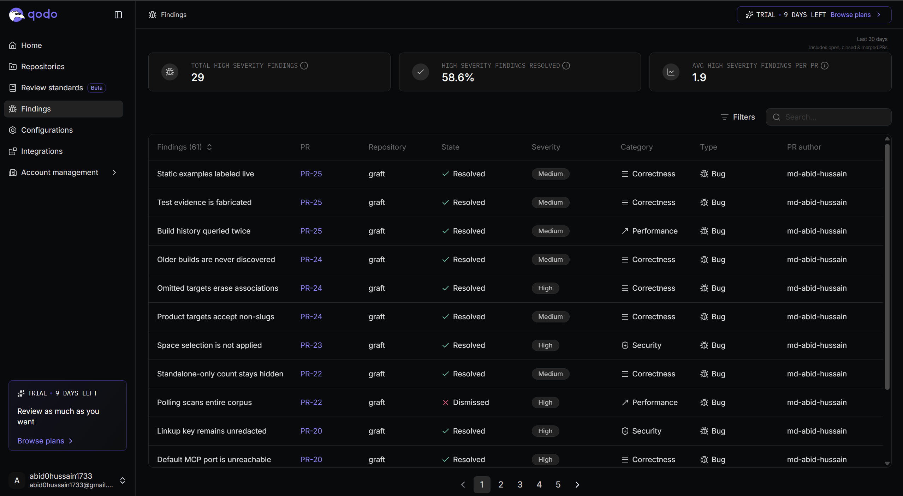

# Qodo Code Review — the full trail

Qodo has reviewed this repository since the first pull request. This file is the
PR-by-PR ledger of what it found and what happened to each finding; the summary and
the highlights live in the [README's evidence section](README.md#qodo-code-review-evidence).

<!-- dashboard screenshot goes here -->

## The process

- Qodo was configured on **day one** — the GitHub App on the repository, the extension
  in the editor.
- **Direct pushes to `main` are disabled.** Every change lands through a pull request,
  squash-merged, so there is no commit on `main` that did not pass through a reviewed PR.
- Every High-severity finding was fixed or dismissed **with its reason recorded** —
  the rule the hackathon sets, applied from PR #1, not retrofitted at submission.
- **61 findings across 20 PRs**, from schema design to the landing page. Three were
  raised against work authored by this project's own build agent, and one of those
  was remediated _by_ the agent.

## How findings were handled — the three postures

**Fixed, as suggested.** The default. Most findings below were accepted and fixed in
the same PR, and Qodo's re-review marks them resolved on the thread.

**Fixed, against the suggested direction.** PR #20's _"Default MCP port is
unreachable"_ was a valid mismatch — the connector default said `:3100` while `next dev`
ran on Next's default `:3000` — but the suggested remedy (align the connector to the
dev port) pointed at a port already held by the Daytona sandbox's API
(`host.docker.internal:3000`). The fix went the other way: `"dev": "next dev -p 3100"`,
with the collision documented in `.env.example` and the quickstart.

**Dismissed, with measurements.** PR #22's _"Polling scans entire corpus"_ was
factually right — the session endpoint calls a full-corpus read on a 4-second poll —
but timing showed the flagged branch cost **3.5 ms** per poll while the _pre-existing_
hackathon branch of the same endpoint cost **80–170 ms** on the same timer. Fixing the
cheap half of a pattern that predates the PR would have been optics, not engineering;
the finding was deferred to an endpoint-level fix with the numbers recorded. (The
bounded `heroBuild()` / `countBuilds()` queries that landed in #25 are the first piece
of that fix.)

## The flagship: a High remediated by the agent that caused it

[PR #23](https://github.com/md-abid-hussain/graft/pull/23) was authored end to end by
`graft-build`, this project's own TrueForge agent. Qodo raised **"Space selection is
not applied"** — High, Security: memory operations without an explicit `containerTag`
fall back to Supermemory's active space, so one project's private context could leak
into another's. The agent remediated it in-thread with an exact-match space protocol
(resolve exactly one space, never fuzzy/active/default, skip the tool entirely when
ambiguous), re-ran the validation suite, and posted the fix commit. Qodo's re-review
strikes the finding as **resolved**.

## The ledger

State is taken from the PR threads (struck findings in Qodo's updated review = resolved).
Severities are shown where confirmed on the dashboard or thread.

### #25 — feat: ui enhancement

- Build history queried twice _(Performance)_ — **resolved**: purpose-built
  `countBuilds()` and bounded, column-scoped `heroBuild()` replaced two unbounded reads.
- Test evidence is fabricated — **resolved**: the hero's claim is now gated on the
  record actually carrying validation evidence.
- Static examples labeled live — **resolved**: example/live chrome labels and an
  honest caption.

### #24 — feat: publish what an agent built

- Omitted targets erase associations _(High)_ — **resolved**
- Product targets accept non-slugs — **resolved**
- Older builds are never discovered — **resolved**

### #23 — feat: add Supermemory MCP (open; authored by `graft-build`)

- Space selection is not applied _(High, Security)_ — **resolved, by the agent** (see above)

### #22 — feat(ui): product-only research runs

- Polling scans entire corpus _(High, Performance)_ — **dismissed with measurements**
  (see above)
- Standalone-only count stays hidden — **resolved**: the learned-count gate moved from
  the hackathon count to the product count, so a corpus with no events still reports.

### #21 — fix(mcp): tool descriptions

- No findings.

### #20 — feat(agents): skills extraction and agent rename

- Default MCP port is unreachable _(High)_ — **resolved, against the suggested
  direction** (see above)
- Linkup key remains unredacted _(High, Security)_ — **resolved**: Bright Data and
  Linkup moved from query-string credentials to `Authorization: Bearer` headers, which
  TrueForge redacts; verified live against both vendors before the change.
- Agent inventory remains stale — **resolved**: README, `.env.example`, code defaults
  and specs now agree on the agent names.

### #19 — fix: index products independently of hackathons

- Valid Markdown rejected _(High)_ — **resolved**
- Batch mixes product ownership — **resolved**
- Counter scans full corpus — **resolved**
- Fetch failures stay untracked — **resolved**

### #17 / #18 — chores

- No findings.

### #16 — feat(ui): design system and routes

- Mobile chat history disappears _(High)_ — **resolved**
- Mobile header overflows — **resolved**
- Moved routes lose redirects — **resolved**

### #14 — feat: rename to Graft

- Agent specs are missing _(High)_ — **resolved**
- Unavailable integration is advertised — **resolved**

### #13 — UI major upgrade

- Executable stored URL links _(High)_ — **resolved**
- Single populated tab unreachable — **resolved**
- Invalid timezone crashes schedule — **resolved**
- Database outage shown as approval — **resolved**
- Detail data fetched twice — **resolved**

### #12 — feat(ui): trueforge chat

- Agent lookup drops authentication _(High)_ — **resolved**
- Missing agent config module _(High)_ — not struck in-thread; the chat surface was
  rebuilt in #13 and #16, which superseded this code.
- Unbounded lookup amplification — **resolved**
- ULID check misclassifies names — **resolved**
- Internal address leaks to clients — **resolved**
- Chat proxy route missing / Proxy exposes administrative API — carried into the
  #13/#16 rework of the same surface.

### #11 — fix(mcp): hackathon keying

- Shortened titles still collide _(High)_ — **resolved**
- Global cap blocks legacy lookups — **resolved**

### #6 — feat(mcp): the contract

- Writes require no authentication _(High)_ — **resolved**
- Arbitrary URL enables SSRF — **resolved**
- Ingestion body is unbounded — **resolved**
- Upsert CLI-created products — **resolved**
- Schema checker is missing — **resolved**
- Omitted notes are erased — **resolved**
- Distinct slugs collide — **resolved**
- Partial socials delete siblings — **resolved**

### #5 — refactor: schema, search, ingest

- Prize data is discarded _(High)_ — **resolved**
- Judging JSON shape mismatches — **resolved**
- Seed command is broken — **resolved**
- Invalid limits fail search — **resolved**

### #4 — feat: ingestion

- Chunk replacement is unsafe _(High)_ — **resolved**
- Source metadata corrections skipped — **resolved**
- Configurable dimensions break storage — **resolved**
- Oversized chunks exceed API limit — **resolved**
- Embedding failures stay pending — **resolved**
- Fence content closes fences — **resolved**
- Fence headings trigger H1 mode — **resolved**

### #3 — refactor: db schema and scripts

- Relationship data is dropped _(High)_ — **resolved**
- Finding updates stay stale — **resolved**
- Database studio command removed — **resolved**

### #2 — db setup

- Migration requires manual prerequisite _(High)_ — **resolved**

### #1 — chore: basic config

- MCP URL targets absent server — **resolved**
- Linux cannot resolve MCP host — **resolved**
- Database exposed with public credentials — **resolved**

---

_Findings and states extracted from the Qodo review threads on each PR; anyone can
re-derive this file by reading them._
